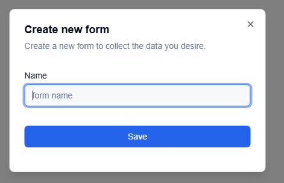
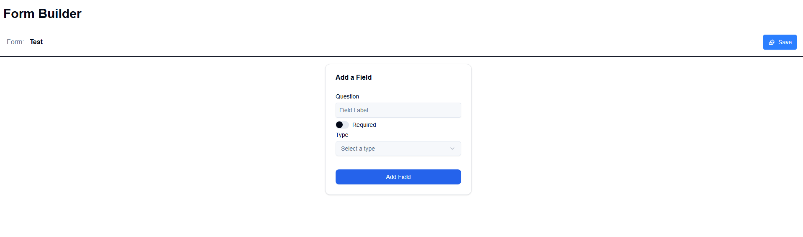
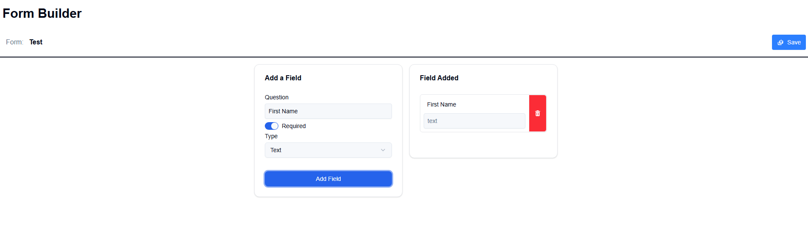
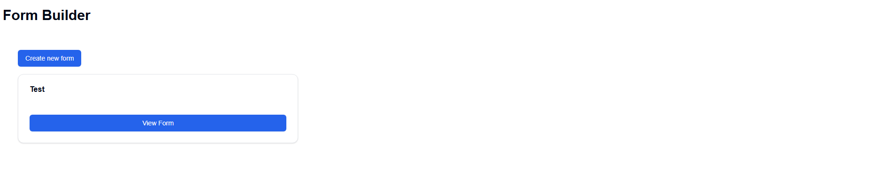
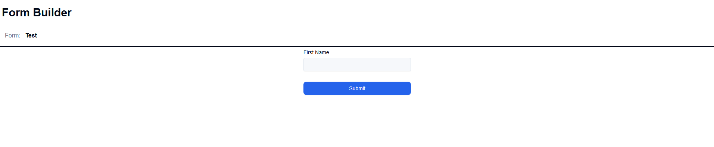

# Running the Project with Docker Compose

This guide explains how to set up and run the **Dynamic Form** project using Docker Compose.

---

## Prerequisites

Before running the project, ensure you have the following installed on your system:

1. **Docker**: [Install Docker](https://docs.docker.com/get-docker/)
2. **Docker Compose**: [Install Docker Compose](https://docs.docker.com/compose/install/)

---

## Steps to Run the Project

### 1. Clone the Repository

Clone the project repository to your local machine:

```bash
git clone https://github.com/your-username/dynamic-form.git
cd dynamic-form
```

### 2. Run docker compose

```bash
docker compose build
docker compose up
```

This will start the PostgreSQL database, the API, and the frontend.

---

## Accessing the Application

You can access the interface in your browser at:

- <http://localhost:3000/>


### Creating a Dynamic Form

1. On the homepage, you can create your dynamic form.
2. First, provide a name for your dynamic form.



3. After submitting your request, you will be redirected to the form's page. There, you can select the type of each field and give it a name.




4. After selecting all the fields you want and saving the structure, you will be redirected to the homepage, where you can now see your form.



### Filling Out a Form

1. Click the "View Form" button to access the form you created.
2. You will then be able to insert data into the form.


